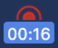
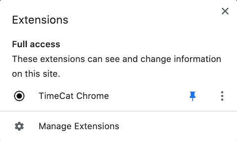
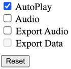

## TimeCat Chrome Plugin 

#### A chrome plugin allows you to use [TimeCat](https://github.com/oct16/TimeCat) to record web pages 

### Install (Alternative)

- Chrome Store: [TimeCat-Chrome](https://chrome.google.com/webstore/detail/timecat-chrome/jgnkkambbdmhfdbdbkljlenddlbplhal) (Recommended)
- CRX: [CRX Downloader](https://standaloneinstaller.com/online-tools/crx-downloader)
   1. input code: `jgnkkambbdmhfdbdbkljlenddlbplhal` and download
   2. install CRX file, see: [Tutorial](https://www.howtogeek.com/120743/how-to-install-extensions-from-outside-the-chrome-web-store/)

### Usage 

1. **Restart your chrome browser after installed**

2. Pin TimeCat-Chrome at Chrome Extension Bar

3. The first click is to record   
The second click to export html file

You can open the options page by right-click on the icon.

This plugin is a beta version

More information see: [TimeCat Github](https://github.com/oct16/TimeCat)
