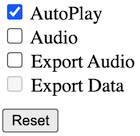

## TimeCat Chrome Plugin 

#### A chrome plugin allows you to use [TimeCat](https://github.com/oct16/TimeCat) for recording

### Usage

The first click is to record.   
The second click to export html video file.

You can open the options page by right-click on the icon.

This plugin is a beta version
